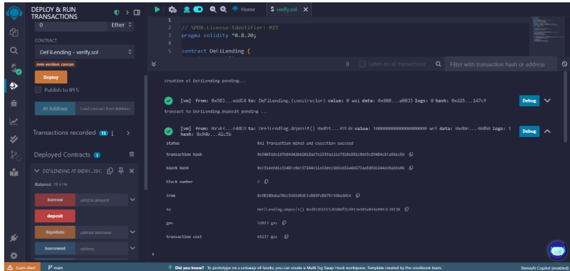
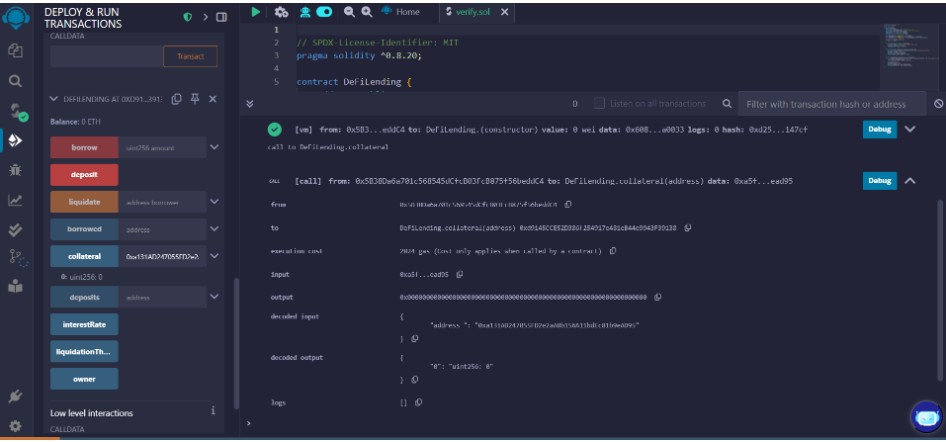
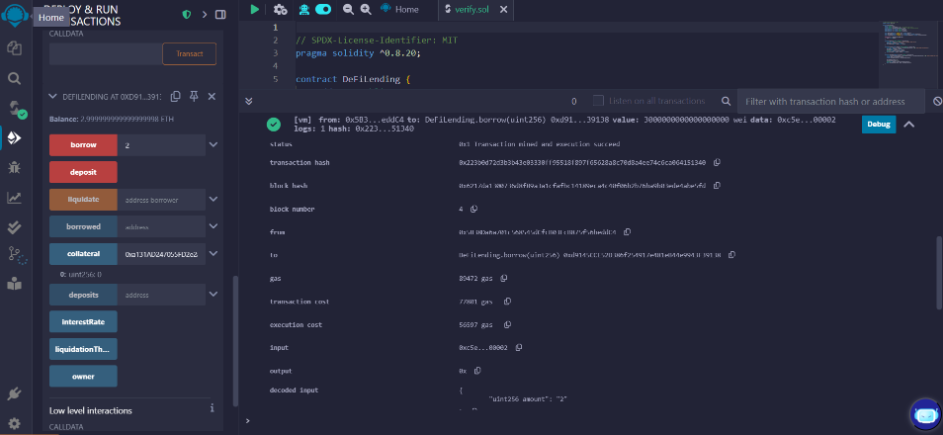

# Experiment 4: DeFi Lending and Borrowing Protocol
## Name: ARUN KUMAR B
## Reg no: 212223230021
## Date : 21-04-2025
# Aim:
To build a decentralized lending protocol where users can deposit assets to earn interest and borrow assets by providing collateral. This experiment introduces concepts like overcollateralization, liquidity pools, and interest accrual in DeFi.

# Algorithm:
## Step 1: Setup Lending and Borrowing Mechanism
*Users deposit ETH into the contract as liquidity.
*Depositors receive interest based on their deposits.
*Borrowers can borrow ETH but must provide collateral (e.g., 150% of the borrowed amount).
*Interest on borrowed funds is calculated dynamically based on utilization rate.


## Step 2: Implement Overcollateralization
If a borrower’s collateral value drops below a certain liquidation threshold, their collateral is liquidated to repay the debt.


## Step 3: Allow Liquidation
If collateral < liquidation threshold, liquidators can repay the borrower's debt and claim their collateral at a discount.


# Program:
```
// SPDX-License-Identifier: MIT
pragma solidity ^0.8.20;

contract DeFiLending {
    address public owner;
    uint256 public interestRate = 5; // 5% interest per cycle
    uint256 public liquidationThreshold = 150; // 150% collateralization
    mapping(address => uint256) public deposits;
    mapping(address => uint256) public borrowed;
    mapping(address => uint256) public collateral;

    event Deposited(address indexed user, uint256 amount);
    event Borrowed(address indexed user, uint256 amount, uint256 collateral);
    event Liquidated(address indexed user, uint256 debtRepaid, uint256 collateralSeized);

    constructor() {
        owner = msg.sender;
    }

    function deposit() public payable {
        require(msg.value > 0, "Deposit must be greater than zero");
        deposits[msg.sender] += msg.value;
        emit Deposited(msg.sender, msg.value);
    }

    function borrow(uint256 amount) public payable {
        require(msg.value >= (amount * liquidationThreshold) / 100, "Not enough collateral");
        borrowed[msg.sender] += amount;
        collateral[msg.sender] += msg.value;
        payable(msg.sender).transfer(amount);
        emit Borrowed(msg.sender, amount, msg.value);
    }

    function liquidate(address borrower) public {
        require(collateral[borrower] < (borrowed[borrower] * liquidationThreshold) / 100, "Not eligible for liquidation");
        uint256 debt = borrowed[borrower];
        uint256 seizedCollateral = collateral[borrower];

        borrowed[borrower] = 0;
        collateral[borrower] = 0;
        payable(msg.sender).transfer(seizedCollateral);
        emit Liquidated(borrower, debt, seizedCollateral);
    }
}

```
# Expected Output:
Users can deposit ETH and earn interest.


Users can borrow ETH by providing collateral.


If collateral < 150% of borrowed amount, liquidators can seize the collateral.


# High-Level Overview:
Teaches key DeFi concepts: lending, borrowing, collateral, liquidation.


Introduces risk management: overcollateralization and liquidation.


Directly related to DeFi protocols like Aave and Compound.

# Output:
## Deposit:

## collateral:

## Borrow:


# RESULT : 
The decentralized lending protocol where users can deposit assets to earn interest and borrow assets by providing collateral is executed succesfully.
